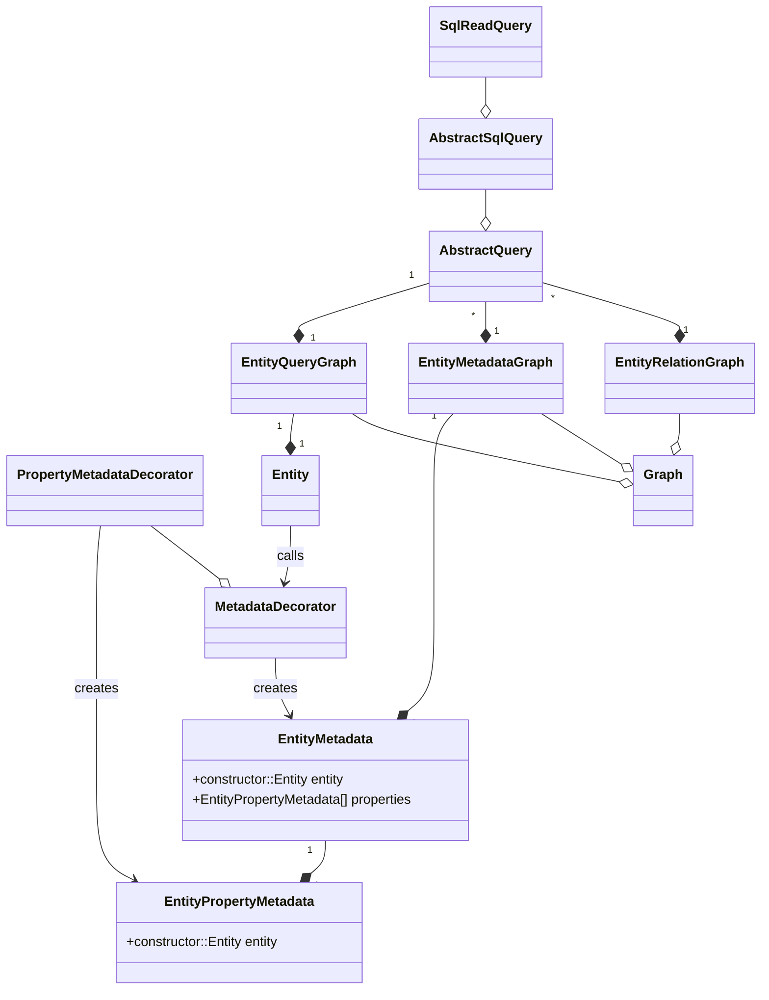
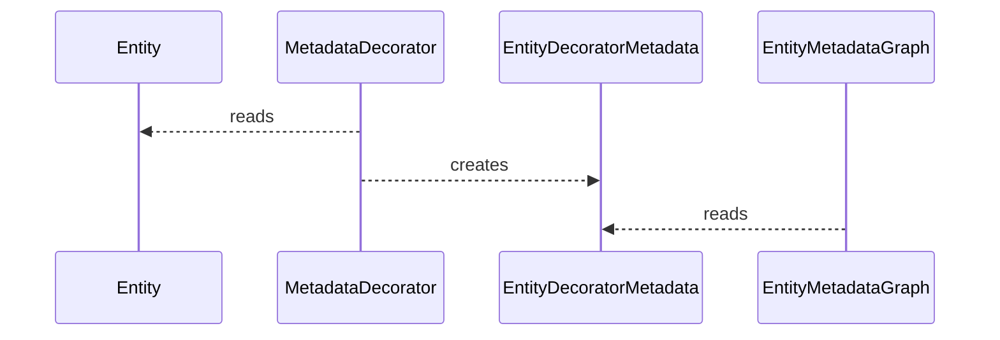
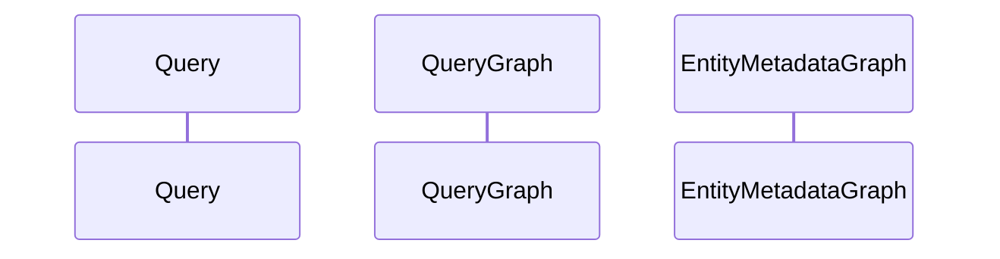

# Implementation

## Diagrams

#### metadata graph creation 

#### query graph creation 

## Workflow

1. Metadata read from decorator callbacks
    * build graph of all specified entities and nested entities that is superimposed with meta
2. Retrieve saved entity from active entity
    * uses metadata to determine how to retrieve entity 
3. Determine diff of saved entity and active entity 
4. Generate CRUD operations from diff
    1. Create
        - sql
            - `INSERT INTO ... VALUES ...;`
    1. Read
        - sql
            - `SELECT ... FROM ... WHERE ...`
            - mvp complete
    1. Update
        - sql
            - `UPDATE ... SET (a=b) WHERE ...`
    1. Delete
        - sql
            - `DELETE FROM ... WHERE ...`
5. Execute CRUD operations from diff

| abstract | psuedo (`A -(C)> B`) | sql | nosql
|----------|--------|-----| -----
|`One-To-One`| `A.b === B && B.a === A` | `select`, `inner join`| lookup
|`One-To-Many`| `A.b === B.a[]`  |`left join on A.b`| iterative select
|`Many-To-One`| `A.b[] === B.a`|`left join on B.a`, `inner join on B.a` | index lookup and shared definition
|`Many-To-Many`| `A.c === C.a[] && C.b[] === B.c` | `inner join on C.a AND inner join on C.b` | intersection of A.c and B.c

## TODO
- [x] implement way to fetch data via entity meta
- [x] implement way to save data
